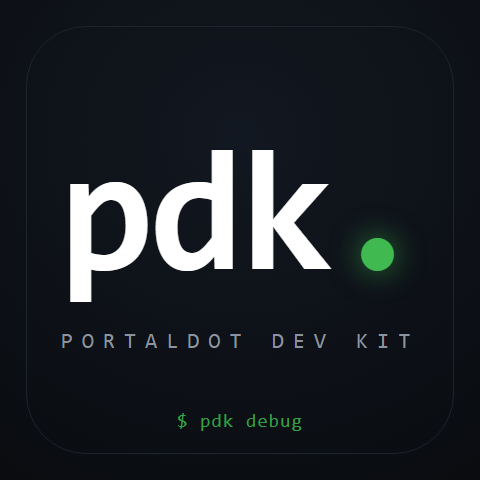

# pdk — Portaldot Dev Kit



[](https://github.com/PugarHuda/portaldot-hackathon-2026-pdk-AmpunBang/actions/workflows/ci.yml)
[](https://github.com/PugarHuda/portaldot-hackathon-2026-pdk-AmpunBang/actions/workflows/pdk-ts.yml)
[](https://github.com/PugarHuda/portaldot-hackathon-2026-pdk-AmpunBang/actions/workflows/docker.yml)
[](https://github.com/PugarHuda/portaldot-hackathon-2026-pdk-AmpunBang/actions/workflows/security.yml)
[](https://pypi.org/project/portaldot-pdk/)
[](https://pypistats.org/packages/portaldot-pdk)
[](https://www.npmjs.com/package/portaldot-pdk-ts)


> 🏆 **1st Place — Portaldot Online Mini Hackathon S1, Builder Tools track.**
> Featured in the [PortalDOT Hackathon Winners Showcase](https://discord.gg/portaldot) (2026-06-15).

A developer toolkit for the [Portaldot](https://www.portaldot.io/) blockchain.
Built during the **Portaldot Online Mini Hackathon S1** — *Builder Tools* track.

**[▶ Live page](https://portaldot-pdk.vercel.app)** · [**Live demo (in-browser)**](https://portaldot-pdk.vercel.app/demo) · [Dashboard](https://portaldot-pdk.vercel.app/dashboard) · [Error reference](https://portaldot-pdk.vercel.app/errors) · [Pitch deck](https://portaldot-pdk.vercel.app/slide) · [Submission](SUBMISSION.md) · [Changelog](CHANGELOG.md)

> **v0.1.6 ([on PyPI](https://pypi.org/project/portaldot-pdk/)).**
> **14 commands** for the whole local dev loop · **AI auto-on** when `PDK_AI_KEY`
> is set (no `--ai` flag; the verified KB stays the source of truth) ·
> **`/demo` web page** replays the actual asciinema cast in your browser ·
> **40 pytest cases + 84 integration & stress cases** verified locally against
> a real `portaldot-1002` node.

> **v0.2 TypeScript companion — [pdk-ts/](pdk-ts/) at alpha.4.**
> 10 of 14 commands live (`doctor`, `accounts`, `pallets`, `storage`, `keys`,
> `explain`, `diagnose`, `examples`, `kb`, `version`). Now importable as a
> library — `import { resolveByName } from 'portaldot-pdk-ts'` cold-imports
> in ~430 ms; offline FailLens lookup in ~40 ms. Signing (`simulate` ·
> `send` · `seed`) lands in alpha.5. Read the
> [pdk-ts roadmap](pdk-ts/README.md#roadmap) for the alpha.5 → 0.2.0 npm ship plan.
>
> Both CLIs read the same knowledge base (`pdk/data/error_fixes.yaml`), so
> one PR benefits both — details in [pdk-ts/CONTRIBUTING.md](pdk-ts/CONTRIBUTING.md).


*Real recording of pdk running against a live Portaldot node. Full **narrated pitch video** (slide intro → 14-command live terminal demo → uniqueness slide → outro, voiced, ~90 s): [`docs/pitch.mp4`](docs/pitch.mp4). Replay interactively at [/demo](https://portaldot-pdk.vercel.app/demo).*

## Try it in 30 seconds

```bash
# Python — decode a failed transaction offline
pip install portaldot-pdk
pdk explain --module 6 --error 2

# TypeScript (alpha) — same thing, from Node.js
npm install portaldot-pdk-ts@alpha
npx portaldot-pdk-ts explain --module 6 --error 2

# Docker — zero-install
docker run --rm ghcr.io/pugarhuda/portaldot-pdk-ts:0.2.0-alpha.4 \
  explain --name balances.InsufficientBalance
```

Live artifacts: [PyPI 0.1.7](https://pypi.org/project/portaldot-pdk/) · [npm alpha.4](https://www.npmjs.com/package/portaldot-pdk-ts) · [GHCR image](https://github.com/PugarHuda/portaldot-hackathon-2026-pdk-AmpunBang/pkgs/container/portaldot-pdk-ts) · [GitHub Releases](https://github.com/PugarHuda/portaldot-hackathon-2026-pdk-AmpunBang/releases) · [Publishing guide](PUBLISHING.md)

---

## Project Overview

**Problem Statement.** Portaldot is a brand-new, Substrate-based, Rust-first
chain. In Season 1 developers run it from a **local node** (the organizers'
intended environment), and the developer experience is rough:

- When a transaction fails, the node returns a raw error like
  `Module error: 0x0600…` — no message, no explanation, no fix. The
  cryptic `Module: { index, error }` code is what blocks every new
  Portaldot builder; nothing in the ecosystem decodes it.
- Newcomers don't know how to get POT or where to start (the hackathon Q&A
  channel is full of *"how do I get POT?"* and *"where's the RPC / faucet?"*).

**Solution.** `pdk` (Portaldot Dev Kit) is a Python CLI with
**15 commands** that owns the local development loop end-to-end, plus a
TypeScript companion (`pdk-ts`, [pdk-ts/](pdk-ts/), at alpha.4 with 10 of
14 commands live — including a library entry point) that will reach parity
by beta.1 and cover what Python currently can't sign on Portaldot V13
metadata. Both CLIs share one knowledge base — run `pdk kb --missing` or
`pdk-ts kb --missing` to see what needs curating:

1. **FailLens** (`pdk debug`) — the hero. Decode any failed transaction
   against the chain's own metadata + a verified 29-entry knowledge base.
2. **Raw-code decoder** (`pdk explain --module 6 --error 2`) — the
   *unique* feature. Resolves the bare `Module { index, error }` code via
   a verified 202-entry runtime index. Nothing else in the Portaldot
   ecosystem does this.
3. **`pdk debug --demo --fix`** — diagnose AND remediate: submit the
   corrected transaction and show it succeed on-chain.
4. **AI auto-on** — set `PDK_AI_KEY` once and every diagnose call
   automatically attaches an "AI-suggested — UNVERIFIED" panel next to
   the verified KB entry; opt out with `--no-ai`.
5. **CI gating** — `pdk debug --json --exit-code` returns rc 2 with a
   machine-readable diagnosis, so a team can fail a build on a decoded
   transaction failure.
6. **Adoption-ready** — `pip install portaldot-pdk` (PyPI v0.1.6),
   cross-platform (Linux + macOS + Windows native).

**Blockchain Relevance.** pdk talks directly to the Portaldot runtime via
Substrate's WebSocket RPC. It uses **native pallets** (not ink! contracts),
which means it works on the real Portaldot node with no ink! caveat —
every command consumes **real POT as gas**, paid by the signing dev
account. The verified knowledge base (`pdk/data/error_fixes.yaml`) is
keyed by `<pallet>.<ErrorName>` matched against live `portaldot-1002`
metadata. The toolkit is *Portaldot-specific*: legacy `LookupSource`
types, contracts API v5 / ink! 3.x quirks, the unique raw-code mapping
that doesn't exist on any other Substrate chain.

## Concept — how FailLens works

`pdk debug` (**FailLens**) is the hero feature. The decode is **metadata-driven**,
so it adapts to any runtime version and never goes stale:

```
failed tx ──▶ System.ExtrinsicFailed event ──▶ DispatchError
          ──▶ resolve against the chain's own metadata  ──▶ error name + docs
          ──▶ match a curated, verified fix knowledge base (3-tier lookup)
          ──▶ plain-language diagnosis + numbered fix
```

The knowledge base (`pdk/data/error_fixes.yaml`) has 29 curated entries, every
name **verified against the live `portaldot-1002` runtime** (202 errors checked).
Unknown errors fall back to the metadata doc comment, so FailLens is useful for
the long tail too.

**Same decoder on the TypeScript side.** `pdk-ts explain` reaches parity
via the shared `error_fixes.yaml` + a bundled `error_index.json` fast
path (offline, no node needed):

```
$ pdk-ts explain --module 6 --error 2

  ✗ Balances.InsufficientBalance  (module 6, error 2)

  What happened
  You tried to transfer more POT than the sending account holds.

  How to fix
  1. Check the sender balance via the Portaldot explorer or `pdk doctor`.
  2. Lower the transfer amount, or fund the account first.
```

Add `--live` to force a full metadata walk against any Substrate chain.
See [`pdk-ts/`](pdk-ts/) for the alpha roadmap.

## PDK vs raw Substrate SDKs

PDK does not compete with the low-level SDKs — it sits on top of them.

| Layer | `@polkadot/api` | PAPI | subxt (Rust) | `substrate-interface` (Py) | **PDK** |
|---|:---:|:---:|:---:|:---:|:---:|
| Low-level RPC + codec | ✅ | ✅ | ✅ | ✅ | uses these |
| Light-client first | — | ✅ | — | — | future (α.6) |
| Ready-made CLI | — | — | — | — | ✅ |
| Metadata-driven error decoder | — | — | — | — | ✅ |
| Curated fix knowledge base | — | — | — | — | ✅ |
| Portaldot-specific quirks (legacy `LookupSource`) | manual | manual | manual | manual | ✅ built-in |
| Community 5-line YAML PR flow | — | — | — | — | ✅ |
| Cross-language coverage (Python + TS) | — | — | — | — | ✅ |

PAPI wins on bundle size and light-client design; that is why PDK will
benchmark against it at α.6 and adopt what fits. But no low-level SDK
ships FailLens, the KB, or the 14-command dev-loop surface — that is
PDK's layer.

## Commands

| Command | What it does |
|---|---|
| `pdk up` | Start a local Portaldot node, show funded dev accounts, verify with a real tx |
| `pdk accounts` | Show the pre-funded dev accounts and their POT balances — *"how do I get POT?"* |
| `pdk debug <hash>` | **FailLens** — decode a failed transaction into a plain-language diagnosis + fix |
| `pdk debug --demo` | Submit a real failing transaction, then decode it |
| `pdk debug --watch` | Live monitor — decode every failed transaction as it lands |
| `pdk debug --json` | Machine-readable output for CI / scripts |
| `pdk debug --demo --fix` | Diagnose, then **apply the fix** — submit the corrected transaction and show it succeed |
| `pdk debug` / `pdk explain` with `PDK_AI_KEY` set | **AI-assisted diagnosis auto-runs** — no flag needed. Set the env var once (`export PDK_AI_KEY=<free OpenRouter key>`) and every diagnose call attaches a yellow "AI-suggested — UNVERIFIED" panel next to the verified KB entry, grounded in the chain's metadata. Override with `PDK_AI_MODEL` / `PDK_AI_BASE`; opt out per-command with `--no-ai`; force the call (printing the setup hint when no key is set) with `--ai` |
| `pdk explain <error>` | Look up what any Portaldot error means and how to fix it — no tx needed |
| `pdk explain --module 6 --error 2` | Decode the **raw** `DispatchError { Module: { index, error } }` code itself — no hash, no name — via a verified runtime index |
| `pdk doctor` | Node version, runtime, ink!/contracts compatibility, and chain-liveness check |
| `pdk simulate` | Preview a transfer's POT fee and feasibility — *without* sending it |
| `pdk seed` | Fund accounts from YAML fixtures so you start from realistic state |
| `pdk pallets` | Browse the runtime's pallets, calls, and errors (from metadata) |
| `pdk send` | Send POT from a dev account — a real on-chain transfer |
| `pdk storage` | Read any value from the chain's storage |
| `pdk watch` | Stream all chain events live (optionally filtered by pallet) |
| `pdk keys` | Generate or inspect a keypair (SS58 format 42) |
| `pdk report` | Scan recent blocks and **summarise every failure by type** — triage at a glance |
| `pdk ai-setup` | Interactive first-run wizard — walks through getting an OpenRouter key, tests it, prints the right export command for your shell |

> **No mocks, no fakes** — every command talks to a live Portaldot node.
> `pdk debug --demo` submits a *real* failing transaction (it is not simulated).

## Setup

Requires **Python 3.11+**. **pdk itself runs natively on every OS, Windows
included** — it's a pure-Python CLI. The *node binary* ships only for **Linux and
macOS** (no Windows build), so on Windows you run the node in **WSL** and let pdk
talk to it from PowerShell (see [Windows](#windows) below).

**1. Get and run a local Portaldot node** (Linux/WSL shown — swap in the
`-macos` archive on macOS):

```bash
wget https://github.com/portaldotVolunteer/Portaldot-node/raw/main/portaldot-testnet-ubuntu.tar.gz
tar -xzf portaldot-testnet-ubuntu.tar.gz
cd portaldot-testnet-ubuntu
chmod +x portaldot_dev
./portaldot_dev --dev --alice --ws-external --rpc-cors all
```

The node listens on `ws://127.0.0.1:9944`. Leave it running.

> If the chain ever stops producing blocks (a dev DB can wedge with
> *"Unexpected epoch change"*), reset it: `./portaldot_dev purge-chain --dev -y`
> then start again. `pdk doctor` detects this for you.

**2. Install pdk** — from PyPI:

```bash
pip install -U portaldot-pdk          # -U forces an upgrade if an old version is cached
pdk --help                            # if `pdk` isn't on PATH, run `python -m pdk.cli --help`
```

…or from source:

```bash
git clone https://github.com/PugarHuda/portaldot-hackathon-2026-pdk-AmpunBang pdk
cd pdk
pip install -e .
```

> **Windows Store Python users:** the `pdk` entry point lands in
> `%LOCALAPPDATA%\Packages\PythonSoftwareFoundation.Python.*\LocalCache\local-packages\Python*\Scripts\`,
> which isn't on PATH by default. Either add that directory to PATH, use
> a venv (`python -m venv .venv && .venv\Scripts\activate && pip install
> portaldot-pdk`), or just invoke as `python -m pdk.cli`.

## Windows

pdk runs natively on Windows — no WSL needed for pdk itself:

```powershell
pip install portaldot-pdk
pdk --help
pdk explain InsufficientBalance   # the error reference works with no node
pdk keys //Alice                  # key tools work with no node
```

The **node** has no Windows build, so to run the node-backed commands (`debug`,
`doctor`, `send`, `watch`, …) start the node in **WSL** with `--ws-external`,
then point pdk at it from PowerShell:

```powershell
# WSL:        ./portaldot_dev --dev --alice --ws-external --rpc-cors all
# PowerShell: connect over WSL's forwarded localhost
pdk debug --demo --node ws://127.0.0.1:9944
```

If `127.0.0.1` doesn't reach WSL on your setup, use the WSL IP
(`wsl hostname -I`): `pdk debug --demo --node ws://<wsl-ip>:9944`. Or point
`--node` at any reachable Portaldot RPC. Inspect on-chain data anytime in the
official explorer: **[portalscan.portaldot.io](https://portalscan.portaldot.io)**.

## Usage

```bash
# 1. Bring the environment up (or just confirm your funded accounts)
pdk up
pdk accounts                      # Alice / Bob / Charlie + their POT balances

# 2. Debug failures
pdk debug --demo                  # submit a failing tx, then decode it
pdk debug 0x<txhash>              # decode a specific failed transaction
pdk debug --watch                 # live: decode failures as they happen
pdk debug --demo --json           # machine-readable output

# 3. Understand & inspect
pdk explain InsufficientBalance   # error reference, no transaction needed
pdk explain --module 6 --error 2  # decode a raw DispatchError code (no node needed)
pdk explain                       # list every error pdk knows
pdk pallets                       # browse the runtime's pallets / calls / errors
pdk doctor                        # node + ink! compatibility + chain liveness

# 4. Preview & seed
pdk simulate --amount 10          # preview a transfer's fee + feasibility (no send)
pdk seed                          # fund dev accounts from fixtures

# 5. Transact & inspect
pdk send //Bob --amount 5         # a real POT transfer
pdk storage Balances TotalIssuance  # read any chain storage value
pdk watch --pallet Balances       # live stream of chain events
pdk keys                          # generate a new keypair

# 6. In CI — gate the build on a transaction result
pdk debug 0x<txhash> --json --exit-code   # exits 2 (with a decoded diagnosis) if it failed
```

## Troubleshooting

Real problems users have hit, with fixes that work. **Full catalogue
(50+ failure modes) in [docs/TROUBLESHOOTING.md](docs/TROUBLESHOOTING.md)**.
If anything else breaks, open an issue with the command + the output.

### `'pdk' is not recognized` (Windows)

You installed pdk but `pdk --version` says `'pdk' is not recognized`. This
is a Microsoft Store Python quirk: it installs `pdk.exe` to a Scripts
directory that isn't on PATH. Three options:

```cmd
:: Option A — invoke as a module (no setup, works immediately)
python -m pdk.cli --version

:: Option B — add Scripts to PATH (one-time)
setx PATH "%PATH%;C:\Users\ASUS\AppData\Local\Packages\PythonSoftwareFoundation.Python.3.13_qbz5n2kfra8p0\LocalCache\local-packages\Python313\Scripts"
:: then close + reopen your terminal

:: Option C — use a venv (cleanest)
python -m venv .venv
.venv\Scripts\activate
pip install portaldot-pdk
pdk --version
```

### `pip install` gives me v0.1.0 (stale)

```bash
pip install --upgrade --force-reinstall portaldot-pdk
```

pip caches wheel files and `Requirement already satisfied` can mean "old
version already installed, skipping upgrade". `-U` (`--upgrade`) plus
`--force-reinstall` always re-fetches.

### `Cannot reach a Portaldot node at ws://127.0.0.1:9944`

The node binary isn't running, or it's running in WSL but pdk can't reach
WSL from Windows. Fixes:

- **Confirm node is up**: in the terminal where you started it, look for
  `Imported #N` lines scrolling past.
- **WSL2 localhost forwarding** is on by default — but if `127.0.0.1`
  doesn't work, get the WSL IP and use that:
  ```bash
  wsl hostname -I        # e.g. 172.21.144.5
  pdk doctor --node ws://172.21.144.5:9944
  ```
- **Dev chain stalled?** Sometimes a `--dev` DB wedges with
  `BABE: Unexpected epoch change`. Reset:
  ```bash
  ./portaldot_dev purge-chain --dev -y
  ./portaldot_dev --dev --base-path /tmp/portaldot-dev
  ```
  `pdk doctor` (without `--no-liveness`) detects this for you.

### AI section doesn't appear even with a key set

1. Confirm the env var is set **in the shell you're running `pdk` in**:
   ```bash
   echo $PDK_AI_KEY    # POSIX
   echo %PDK_AI_KEY%   # cmd
   ```
2. Run the wizard to actually round-trip a request:
   ```bash
   pdk ai-setup --test
   ```
   It tells you whether the key reaches OpenRouter and the configured
   model responds.
3. If `--no-ai` is in your shell history or wrapping script, it wins over
   auto-on. Try `pdk debug --demo` with no flags.

### `Send failed: Inability to pay some fees` even though I have balance

The fee estimator is conservative. If you've been running `pdk debug --demo`
warm-ups, Alice's balance is slightly under 50,000 POT (each demo costs a
small fee). Use a smaller amount, or restart the node to reset state:

```bash
pkill -f portaldot_dev
./portaldot_dev purge-chain --dev -y && ./portaldot_dev --dev --base-path /tmp/portaldot-dev
```

### Rich output crashes on Windows with `UnicodeEncodeError`

Fixed in v0.1.1+ — pdk forces UTF-8 stdout at startup. If you're on an
older version, upgrade:

```bash
pip install -U portaldot-pdk
```

### `release.yml` fails after a repo rename

See [CONTRIBUTING.md](CONTRIBUTING.md) — the release workflow uses an API
token (`PYPI_API_TOKEN` secret) rather than PyPI Trusted Publishing because
the latter pins to a specific repo name and any rename breaks it.
`workflow_dispatch` lets a maintainer re-trigger the publish from the
Actions tab without pushing a new tag.

### Vercel canonical domain returns 404 after repo rename

```bash
# from web/ directory, using cached Vercel CLI auth:
vercel git connect https://github.com/PugarHuda/portaldot-hackathon-2026-pdk-AmpunBang
vercel deploy --prod
vercel alias set <new-deploy-url> portaldot-pdk.vercel.app
```

The first push after this fixes auto-deploy permanently.

## Use in CI

`pdk` is built to gate a pipeline, not just to run interactively.
`pdk debug --json --exit-code` exits non-zero with a machine-readable diagnosis
when a transaction failed, so a Portaldot project can fail its build with a clear
reason instead of a raw `Module error: 0x0600…`. See
[`docs/ci-recipe.md`](docs/ci-recipe.md) for a copy-paste GitHub Actions workflow
that boots a node, runs integration transactions, and gates on the result.

Example — `pdk debug --demo`:

```
✗ Balances.InsufficientBalance

What happened
You tried to transfer more POT than the sending account holds.

How to fix
  1. Check the sender balance via the explorer or `pdk doctor`.
  2. Lower the amount, or fund the account first.
```

## Technical Architecture

**Overall flow:**

```
┌──────────────┐   typer CLI   ┌──────────────┐   substrate-interface   ┌────────────────┐
│  pdk <cmd>   │ ───────────▶  │  pdk/core/   │ ─────────────────────▶ │  Portaldot     │
│ (14 commands)│               │  chain.py    │   websocket RPC        │  node (1002)   │
└──────────────┘               │  decoder.py  │ ◀───────────────────── └────────────────┘
                               │  knowledge.py│      ExtrinsicFailed event
                               │  report.py   │      DispatchError { Module: idx,err }
                               │  ai.py       │
                               └──────┬───────┘
                                      │ 3-tier lookup (exact key → name-only → metadata-doc)
                                      ▼
                               ┌──────────────┐   optional: opt-in       ┌────────────────┐
                               │ verified KB  │   PDK_AI_KEY set         │ OpenRouter LLM │
                               │ 29 entries   │ ─────────────────────▶  │ (gpt-oss-120b) │
                               │ + 202-entry  │                          └────────────────┘
                               │ runtime idx  │
                               └──────────────┘
```

**Core tech stack:**

- **Blockchain platform:** Portaldot (Substrate-based, runtime `portaldot-1002`, Contracts API v5 / ink! 3.x)
- **Smart contracts:** *none* — pdk uses **native pallets + metadata-driven decoding**, so it works on the real Portaldot node with no ink! caveat. The hackathon's native-deployment requirement is satisfied by real `Balances.transfer` calls; sample tx hash below.
- **CLI language:** Python 3.11+
- **Chain RPC client:** [`substrate-interface`](https://github.com/polkascan/py-substrate-interface) (with the `substrate-node-template` type-registry preset for Portaldot's legacy `LookupSource`)
- **CLI framework:** [`typer`](https://typer.tiangolo.com/) + [`rich`](https://github.com/Textualize/rich) (terminal UI), [`pyyaml`](https://pyyaml.org/) (knowledge base)
- **Optional AI layer:** standard-library `urllib` → any OpenAI-compatible endpoint (defaults to OpenRouter's free `openai/gpt-oss-120b:free`); zero hard dependency, auto-on when `PDK_AI_KEY` is set
- **Web companion:** Next.js 14 (App Router, React) deployed on Vercel — landing, in-browser dashboard, error reference, pitch deck, **interactive asciinema replay of all 14 commands**
- **Test + CI:** `pytest` (40 unit tests) on Python 3.11 & 3.12 via GitHub Actions; comprehensive QA harness (gitignored) covers 84 additional integration + stress cases against a live node
- **Release pipeline:** auto-publish to PyPI on `v*` tag push (token-auth, survives repo renames; manually re-triggerable via `gh workflow run release.yml`)

## Smart Contracts

*Skip — this project does not use smart contracts.* pdk talks to native
Substrate pallets (Balances, System, Assets, Contracts pallet for *reading*
metadata, etc.) via WebSocket RPC. The native-deployment requirement is
satisfied by real `Balances.transfer` extrinsics paying POT as gas — sample
proof tx hash below.

The "Contracts pallet present, but ink! 3.x only" caveat that `pdk doctor`
surfaces is one of the reasons pdk avoids ink! and uses native pallets: most
ink! 4.x+ contracts won't deploy on the current Portaldot node, and pdk is
designed to work on the real chain without that caveat.

## Demo

- **Pitch video (~81 s, voiced):** `docs/pitch.mp4` — slide intro + **52 s live terminal demo** (fresh venv → `pip install portaldot-pdk` → all 14 commands against a real node) + uniqueness slide + outro. YouTube link added after upload.
- **Live page:** https://portaldot-pdk.vercel.app
- **Interactive dashboard** (in-browser FailLens you can type into): https://portaldot-pdk.vercel.app/dashboard
- **Searchable error reference:** https://portaldot-pdk.vercel.app/errors
- **Pitch deck:** https://portaldot-pdk.vercel.app/slide
- **Test accounts:** `//Alice`, `//Bob`, `//Charlie` — pre-funded with POT on `--dev`. Run `pdk accounts` to see addresses + balances.
- **Native-deployment proof tx hash:** see [Native deployment proof](#native-deployment-proof) below.

## Architecture

```
pdk/
  cli.py            typer app; registers the 14 commands (up, accounts, debug,
                    explain, doctor, simulate, seed, pallets, send, storage, watch, keys, report)
  config.py         static defaults (node URL, scan depth, binary name)
  commands/         one thin module per command (parse args → call core → render)
  core/
    chain.py        connect(), submit_call(), trigger_demo_failure(),
                    dev_account_balances(), free_balance()
    decoder.py      decode_receipt(), find_receipt(), failed_receipts_in_block()
    knowledge.py    load_knowledge(), lookup_fix()  (3-tier resolution)
  data/
    error_fixes.yaml  the verified fix knowledge base
```

Command modules stay thin; all chain logic lives in `core/`. Connections use the
`substrate-node-template` type preset, required for Portaldot's legacy
`LookupSource` type.

## Native deployment proof

`pdk up` and `pdk debug --demo` submit **real transactions to a local Portaldot
node, paying POT as gas**. Sample evidence (tx from a local dev node):

```
tx hash : 0x8b605579d6b512892f4394aa43937e1d762d34411b43c6a4aa9fa8a5dd4d546a
node    : local Portaldot dev node (portaldot_dev 2.0.0, chain "Development")
fee     : paid in POT by the submitting account
```

Per the organizers' guidance, localhost is the intended Season-1 environment and
a tx hash from a local node is valid native-deployment proof.

## Testing

```bash
PYTEST_DISABLE_PLUGIN_AUTOLOAD=1 python -m pytest tests/ -q
```

The env var avoids a clash with unrelated third-party pytest plugins in a polluted
global environment; a clean venv (or CI) does not need it. CI runs the suite on
every push (Python 3.11 and 3.12).

## Team

- **Team name:** **AmpunBang**
- **Members:** Pugar Huda Mantoro ([@PugarHuda](https://github.com/PugarHuda)) — solo full-stack developer (CLI, web, design, knowledge base).
- **Contact:** hudapugar@gmail.com (for hackathon communication only).

## License

MIT. All code is open source.

## Roadmap & known limitations

Two deferred capabilities — **asset/token seeding** and **ink! contract
deployment** — are blocked by the same upstream issue: `substrate-interface`
(pdk's Python backend) mis-signs *custom-pallet* calls (Assets, Contracts) on
Portaldot's **V13 metadata**, returning `Invalid Transaction: bad signature`.
Balances calls sign correctly, so `pdk send` / `seed` / `simulate` build on them.
(Confirmed across era and type-registry variations; see
[substrate-interface #9](https://github.com/polkascan/py-substrate-interface/issues/9).)

The clean unlock is a **typed TypeScript SDK on `@polkadot/api`**, which handles
V13 custom-pallet signing correctly — the natural next step for pdk, alongside
deeper CI and editor integrations.
